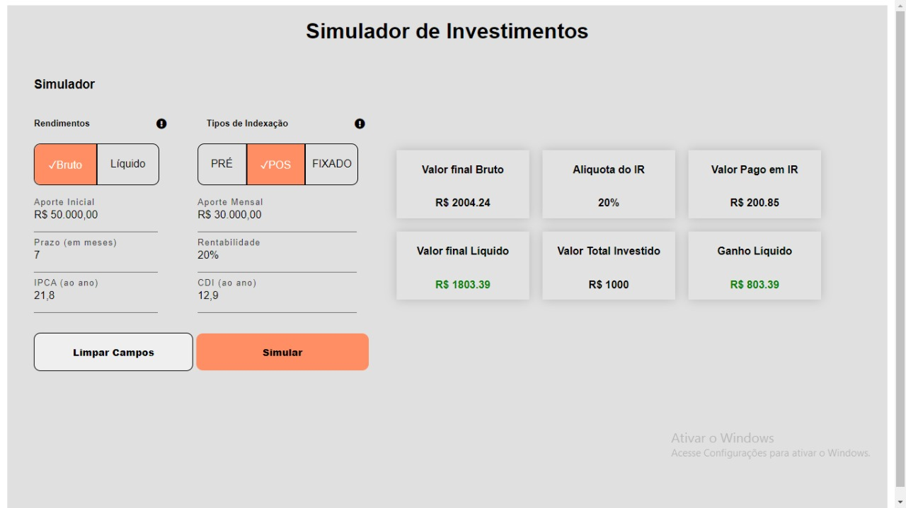

<h1>Simulador de Investimentos</h1>

## :green_book: About

Aplicação que permite ao usuário realizar uma simulação de rendimentos de acordo com o tipo de indexação e tipo de rendimento escolhido.

:hammer: O que foi utilizado:

<ul>
  <li>HTML</li>
  <li>CSS</li>
  <li>JAVASCRIPT</li>
  <li>API</li>
</ul>

<h2>Como executar:</h2>
<ul>
  <li>Preencha todos os campos.</li>
  <li>Não pode haver letras</li>
  <li>Clique em "Simular"</li>
</ul>

</img>
<h4>Aparencia do projeto ao ter todos os inputs preenchidos e ao clicar no botão "simular"</h4>
